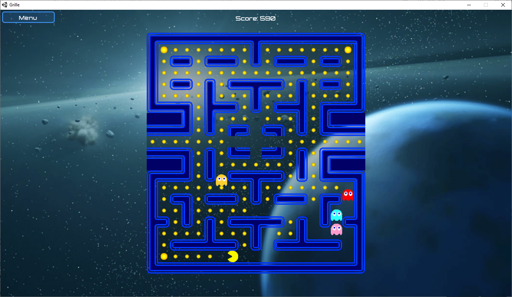

# The-pacman-coop

The aim of the project was to experiment co-operative Unity ML-Agents vs human/non-human players using an existing Pacman environment made in Unity. However, we were not able to train the agent properly and the results are not very convincing.

## Demonstration Video

## Team Composition
- Giorgos Petkakis
- Inês Batina
- Inês Lobo
- Sylvain Lapeyrade

## Pacman-unity
The game is based on this reposiory https://github.com/todorico/pacman-unity.

## Game

